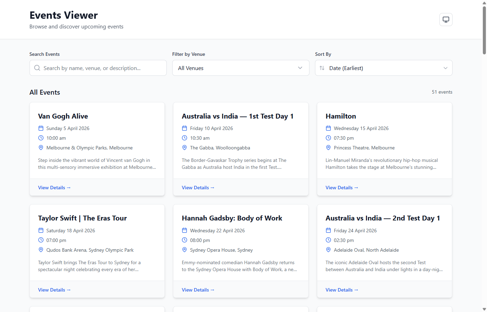

<div align="center">

# Events Viewer

### An event discovery platform for Australian entertainment

Browse 51 real-world events across 12 venues — concerts, AFL, cricket, theatre, comedy, festivals, and exhibitions. Search, filter, sort, and toggle dark mode.

[](http://teg-events-viewer.s3-website-ap-southeast-2.amazonaws.com)

[](https://react.dev/)
[](https://www.typescriptlang.org/)
[](https://vitejs.dev/)
[](https://tailwindcss.com/)

</div>

---

<div align="center">
  
</div>

---

## What It Does

| Feature | Details |
|:--------|:--------|
| **51 Events** | Concerts (15), Sports (17 — AFL, Cricket, NRL), Theatre (6), Comedy (5), Festivals (4), Exhibitions (4) |
| **12 Venues** | Sydney Opera House, MCG, SCG, Rod Laver Arena, Qudos Bank Arena, The Gabba, RAC Arena, Adelaide Oval, and more |
| **Search** | 300ms debounced — searches event name, description, and venue (case-insensitive) |
| **Venue Filter** | Dropdown with all 12 venues, sorted A-Z with city/state labels |
| **Sort** | Date (earliest/latest) or Name (A-Z / Z-A) |
| **Event Modal** | Click any card for full details — close with ESC, overlay click, or X button |
| **Dark Mode** | Light / Dark / System toggle, persisted to localStorage |
| **Fallback Data** | Graceful degradation with 8 realistic sample events if API is unavailable |
| **Responsive** | 1-column mobile, 2-column tablet, 3-column desktop |

---

## Event Lineup

| Category | Count | Highlights |
|:---------|------:|:-----------|
| **Concerts** | 15 | Taylor Swift, Ed Sheeran, Coldplay, Billie Eilish, Tame Impala, Flume |
| **Sports** | 17 | AFL rounds + Grand Final, Australia vs India Test cricket, NRL Finals |
| **Theatre** | 6 | Hamilton, Wicked, Les Mis, Phantom, Come From Away, SIX |
| **Comedy** | 5 | Hannah Gadsby, Jim Jefferies, Celeste Barber, Wil Anderson, Trevor Noah |
| **Festivals** | 4 | Splendour in the Grass, Falls, Laneway, Bluesfest |
| **Exhibitions** | 4 | Van Gogh Alive, Tutankhamun, Jurassic World, Immersive Monet |

---

## Tech Stack

| Layer | Technology |
|:------|:-----------|
| **Framework** | React 18 + TypeScript 5 |
| **Bundler** | Vite 5 |
| **Styling** | Tailwind CSS 3 (dark mode via `class` strategy) |
| **Icons** | Lucide React |
| **Debounce** | use-debounce (300ms search delay) |
| **Data** | Self-hosted JSON API in `public/data/` — HAL-JSON format |
| **Testing** | Jest + React Testing Library |

---

## Architecture

- **Self-Hosted API** — Event data served from `public/data/event-data.json` (no external API, no CORS issues)
- **Memoized Components** — All display components wrapped in `React.memo()`
- **Debounced Search** — 300ms delay prevents excessive re-renders
- **Optimized Filtering** — `useMemo` for filtering/sorting, `useCallback` for event handlers
- **Error Boundary** — Catches React errors with retry UI
- **Theme System** — ThemeContext with system preference detection and localStorage persistence
- **Env-Aware Logger** — Suppresses debug output in production

---

## Project Structure

```
src/
├── api/              HTTP client + event fetching/transformation (HAL-JSON)
├── components/       EventList, EventCard, EventDetail, SearchInput,
│                     VenueSelector, SortSelector, ThemeToggle,
│                     LoadingSpinner, ErrorBoundary
├── config/           Type-safe environment variables
├── constants/        Fallback event data (8 realistic events)
├── context/          ThemeContext (light/dark/system), AppContext
├── hooks/            useEventsData (fetch + loading/error/refetch)
├── types/            Event, Venue, API response types, Zod schemas
└── utils/            Logger, date formatter (AU locale), error handler

public/
└── data/
    └── event-data.json   51 events across 12 venues (HAL-JSON)
```

---

## Getting Started

```bash
git clone https://github.com/Rohit23SR/Events-Viewer.git
cd Events-Viewer
npm install
npm run dev
```

Open [http://localhost:5173](http://localhost:5173). Loads 51 events from local JSON — no external API needed.

---

## Scripts

| Command | Description |
|:--------|:------------|
| `npm run dev` | Vite dev server |
| `npm run build` | Production build (tsc + vite) |
| `npm run preview` | Preview production build |
| `npm run test` | Jest unit tests |
| `npm run lint` | ESLint check |
| `npm run format` | Prettier format |

---

## Deployment

Hosted on **AWS S3** as a static website (ap-southeast-2).

```bash
npm run build
aws s3 sync dist/ s3://teg-events-viewer --delete
```

---

## License

Private and proprietary.
